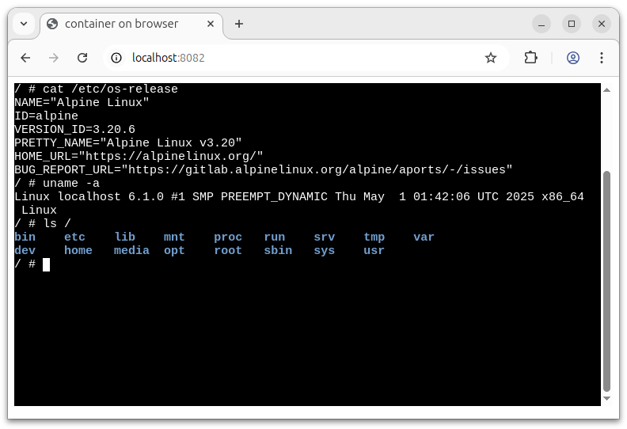

# Example of running containers on browser with QEMU

c2w's `--to-js` flag enables to run containers on QEMU ported to browser with emscripten ([QEMU Wasm](https://github.com/ktock/qemu-wasm)).
Multicore CPUs can also be enabled leveraging MTTCG(Multi-Threded TCG).

This example focuses on simplicity so it doesn't enable [networking feature](../networking) of the container.
For a full-featured example with enabling and utilizing of networking, refer to [`../emscripten/`](../emscripten/).

## Step 1: Converting an image to Wasm

x86_64, AArch64 and RISCV64 containers are supported as of now.

### Converting x86_64 container to Wasm

```
$ mkdir -p /tmp/out-js4/htdocs
$ c2w --to-js alpine:3.20 /tmp/out-js4/htdocs/
```

### Converting AArch64 container to Wasm

```
$ mkdir -p /tmp/out-js4/htdocs
$ c2w --to-js --target-arch=aarch64 arm64v8/alpine:3.20 /tmp/out-js4/htdocs/
```

### Converting RISC-V container to Wasm

```
$ mkdir -p /tmp/out-js4/htdocs
$ c2w --to-js --target-arch=riscv64 riscv64/alpine:3.20 /tmp/out-js4/htdocs/
```

### Increasing number of emulated CPU cores

QEMU Wasm enables MTTCG(Multi-Threaded TCG) of QEMU for utilizing host's multiple cores for emulating guest CPUs.
You can emulate multiple guest CPUs using a build arg `VM_CORE_NUMS=<number of CPUs>`.
For example, the following emulates 4 CPUs with MTTCG enabled.

```
$ c2w --to-js --build-arg VM_CORE_NUMS=4 alpine:3.20 /tmp/out-js4/htdocs/
```

## Step 2: Start a server

Serve the image as the following (run them at the repository root dir):

```
$ cp ./examples/emscripten/xterm-pty.conf /tmp/out-js4/
$ cp -R ./examples/emscripten-simple/htdocs/* /tmp/out-js4/htdocs/
$ docker run --rm -p 127.0.0.1:8082:80 \
         -v "/tmp/out-js4/htdocs:/usr/local/apache2/htdocs/:ro" \
         -v "/tmp/out-js4/xterm-pty.conf:/usr/local/apache2/conf/extra/xterm-pty.conf:ro" \
         --entrypoint=/bin/sh httpd -c 'echo "Include conf/extra/xterm-pty.conf" >> /usr/local/apache2/conf/httpd.conf && httpd-foreground'
```

## Step 3: Accessing to the pages

The page `localhost:8082` provided by the above server runs the container inside browser.


